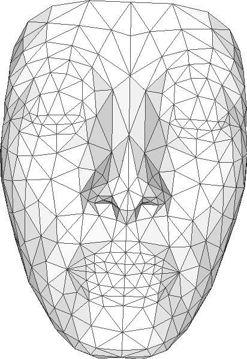
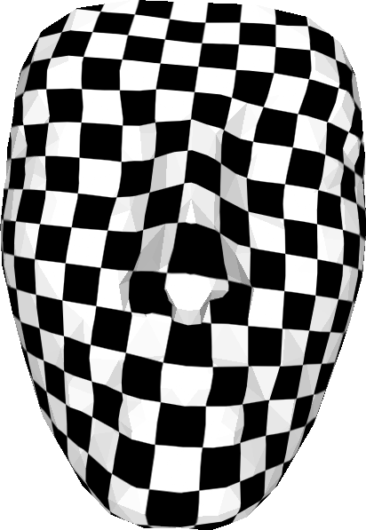
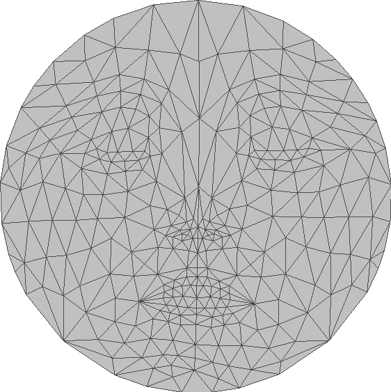
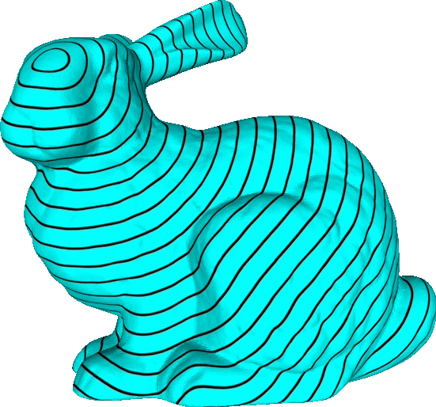

# LBO
Discrete Laplace Beltrami Operator (LBO) and related applications.

## Applications:

### Disk Harmonic Map
Disk Harmonic Map maps a surface homeomorphic to the planar unit disk. It is a popular parameterization method. An example of disk harmonic map on a nefertiti model is shown below:

### Heat method
The heat method ([1]) is a discrete geodesic solution on various domains (grids, triangle/polygonal meshes, point clouds etc.). The implementation here is based on triangle mesh only. Here is an example output of heat method on a bunny model:

[1] Crane K, Weischedel C, Wardetzky M. Geodesics in heat: A new approach to computing distance based on heat flow[J]. ACM Transactions on Graphics (TOG), 2013, 32(5): 152.
